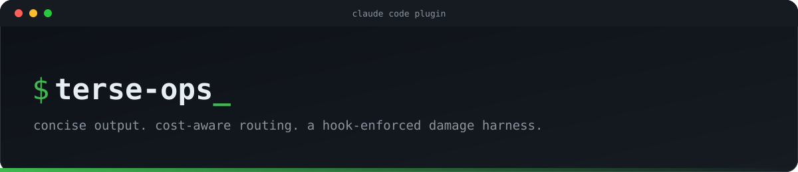

<p align="center">
  
</p>

<p align="center">
  <a href="LICENSE"></a>
  <a href="https://github.com/nihalantiir/terse-ops/tags"></a>
  <a href="https://github.com/nihalantiir/terse-ops/issues"></a>
  <a href="https://docs.claude.com/en/docs/claude-code/plugins"></a>
</p>

A Claude Code plugin marketplace for concise, disciplined, cost-aware agentic work.

The top model plans, delegates, and verifies. Cheaper models do the mechanical labor beneath it. A hook-enforced damage harness limits blast radius. Failures get reported once, not researched forever.

**Contents:** [Role of terse-ops](#role-of-terse-ops) · [Install](#install) · [Updating](#updating) · [What's in it](#whats-in-it) · [License](#license) · [Wiki](https://github.com/nihalantiir/terse-ops/wiki)

## Role of terse-ops

This governs *how* Claude works, not what it builds.

- **Owns:** voice and output style, cost-aware delegation across model tiers, spend limits, and repo safety (the hook-enforced harness).
- **Doesn't own:** domain work. Framework, infra, and language-specific plugins still write the actual React, Terraform, SQL, or whatever the task calls for. terse-ops applies underneath them, the same way no matter which specialist plugin is doing the domain-specific part.
- **On conflict:** safety always wins. If a domain plugin's own instructions clash with a rule here (the hook block list, the no-commit default), the safety rule takes it. Style and routing are the part meant to be composed with, not fought.

The `compose` skill makes this explicit and behavioral, not just documentation.

## Install

```
/plugin marketplace add nihalantiir/terse-ops
/plugin install terse-ops@terse-ops
```

## Updating

Same command in both the CLI and the Claude web app (claude.ai/code):

```
/plugin marketplace update terse-ops
```

This refreshes the marketplace listing and bumps any plugin installed from it to the new version. If it reports that a reload is needed, run `/reload-plugins` (or restart Claude Code) to activate the update. There's no separate reinstall step.

In the web app, the same actions live under `/plugin` → **Marketplaces** tab (update listings, or turn on auto-update) and **Installed** tab (see what's currently active).

## What's in it

This marketplace currently ships one plugin: [`terse-ops`](plugins/terse-ops/README.md), which adds:

- **Skills**: a thin always-on core (output style incl. `clean`/`tight`/`grunt` compression, damage harness, fail-fast reporting, tool-call economy, composing with domain-specific plugins) plus six on-demand skills (orchestration/routing, delegate verification, auto-mode discipline, verified research, spend/usage-tier limits, reasoning-effort discipline) invoked explicitly when you want them active for a session
- **Commands**: `/terse-ops:route`, `/terse-ops:verify-now`, `/terse-ops:status`, `/terse-ops:mode`, `/terse-ops:solo`, `/terse-ops:allow`, plus one `/terse-ops:<name>` per on-demand skill above
- **Agents**: `scout`, `researcher`, `builder`, `checker`, and `architect`. Matched-cost subagents for codebase search, web research, mechanical implementation, verification, and a deep-reasoning planning pass, so the orchestrator isn't doing every step itself at top-model cost
- **Hooks**: a `PreToolUse` guard that blocks the harness skill's hard "never" list (commits on your behalf, force-push, `--no-verify`, `rm -rf`, `reset --hard`, `branch -D`, `clean -f`, `terraform destroy`, `kubectl delete`, `DROP TABLE`) at the tool-call level, not just as a prompt instruction. Most carry a scoped one-shot override or a standing, per-repo allow granted via `/terse-ops:allow`; `--no-verify`/`--no-gpg-sign` never has either
- **Tests**: a 46-case, ungated shell/PowerShell suite asserting the hook's allow/block decisions, running in CI on every push (`.github/workflows/hook-tests.yml`)
- **Evals**: `claude plugin eval` cases covering the same hook blocks and output brevity at the agent-behavior level (early access, not yet runnable, see `plugins/terse-ops/evals/README.md`)

See the [plugin README](plugins/terse-ops/README.md) for the full breakdown of each skill and agent, or the [wiki](https://github.com/nihalantiir/terse-ops/wiki) for the deep reference — including the [Prompt Guide](https://github.com/nihalantiir/terse-ops/wiki/Prompt-Guide) for making plain language trigger the on-demand skills instead of typing the exact command.

## License

MIT. See [LICENSE](LICENSE).
